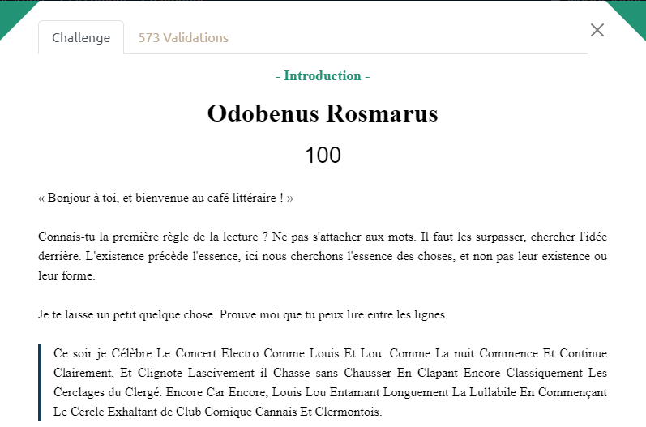

# 404CTF 2023: Des mots, des mots, des mots

## The scenario



In the text we can see something sus with the letter (C/L/E) and if we type Odobenus Rosmarus in google we get the animals morse

We can make a link beetween C -> "." L -> "\_" E -> " "

```python
 string = "Ce soir je Célèbre Le Concert Electro Comme Louis Et Lou. Comme La nuit Commence Et Continue Clairement, Et Clignote Lascivement il Chasse sans Chausser En Clapant Encore Classiquement Les Cerclages du Clergé. Encore Car Encore, Louis Lou Entamant Longuement La Lullabile En Commençant Le Cercle Exhaltant de Club Comique Cannais Et Clermontois."

lettre = ["C","E","L"]

char = ""

for i in range(len(string)):
    if string[i] in lettre:
        char += string[i]

print(char)

char = char.replace("C",".")
char = char.replace("L","-")
char = char.replace("E"," ")

print(char)
```

We get this : ..-. .- -.-. .. .-.. . .-.. . -- --- .-. ... .

and if we decode it we got `FACILELEMORSE`

## Flag

``FACILELEMORSE``