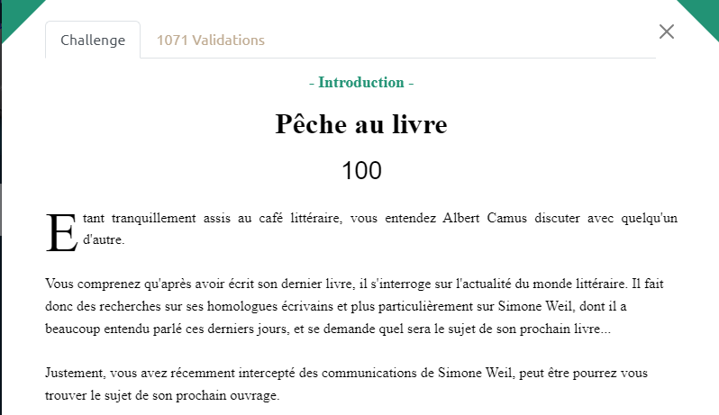
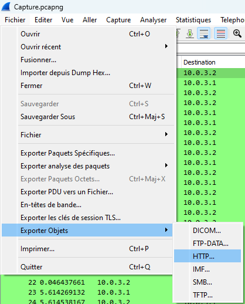

# 404CTF 2023: Pêche au livre

## The scenario

We can understand we have a capture.pcapng made on wireshark

and we need to find a book on it.

If we simply do this :

We get this 

And in Hegel-sensei-uwu.png there is the flag

## Flag

`404CTF{345Y_W1r35h4rK}`
