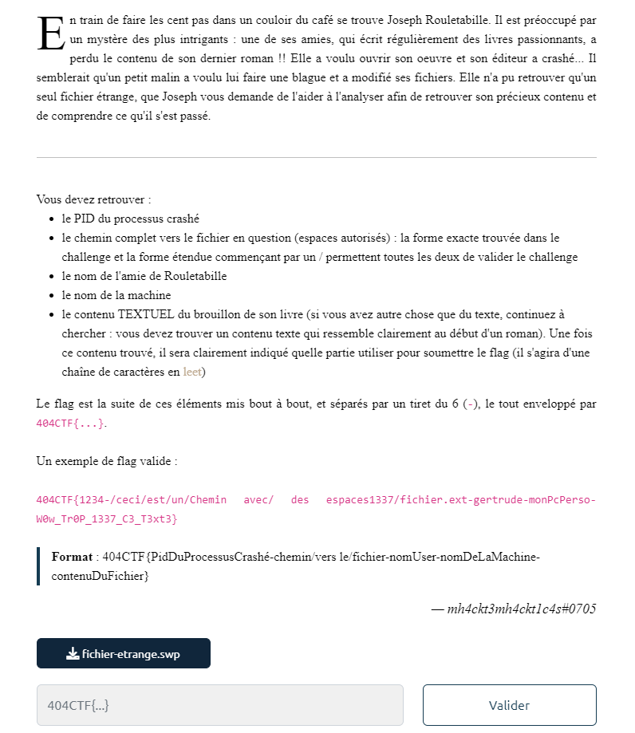
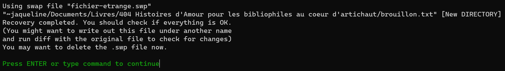
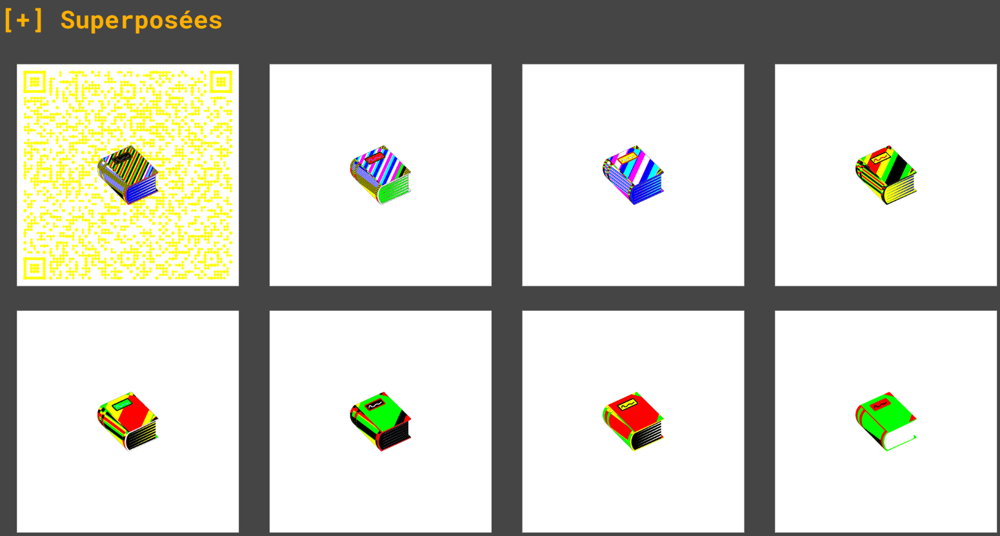
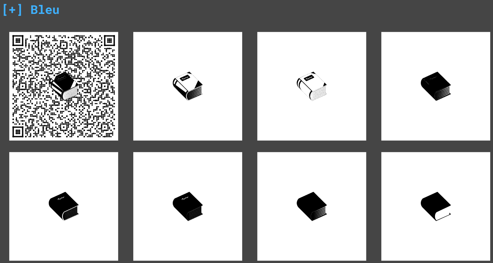

# 404 2023 : Mystere du roman d'amour

### The scenario



In this challenge, we have a swp file and we need to find :

- The pid of the process

- The path to the file

- The name of the friend Rouletabille

- The host name

- The text content of his book, it will be clearly indicated which part to use (it will be a leet tring)

With all of this information we can flag the challenge with the following format :

`404CTF{pid-path-friendname-hostname-leetstring}` 

### Getting some information

if we try to do some basic command on fichier-etrange.swp like **strings**

```bash
strings fichier-etrange.swp

b0VIM 7.4
[9d&(J
jaqueline
aime_ecrire
~jaqueline/Documents/Livres/404 Histoires d'Amour pour les bibliophiles au coeur d'artichaut/brouillon.txt
```

or **file**

```bash
file fichier-etrange.swp

fichier-etrange.swp: Vim swap file,
version 7.4, 
pid 168, 
user jaqueline, 
host aime_ecrire, 
file ~jaqueline/Documents/Livres/404 Histoires d'Amour pour les bibliophiles au coeur d'artichaut/brouillon.txt
```

We got the pid, the friend of Rouletabille, the host name, the path of the file

After a little bit of research on a swp file with vim

It say swp file is a swap file and it store a recovery version of a file being deleted

# Recovering the file

With this information we can open the file with vim in recovery mode :

```bash
vim -r fichier-etrange.swp
```



We just need to press **ENTER** and save the document as a .txt you would say but no !

At first it was just a file with a lot's of random character but if you watch closely there is the tag <u>PNG</u> at the top of the file

We can deduce really quickly we are trying to recover a png file 

```vim
:w output.png
```

We get this png :


Not looks like a leet string sadly

### Finding the information

With a little bit of stegano we can think about something like lsb or some stuff like this so i tried my favorite website : [Aperi'Solve](https://www.aperisolve.com/38d147583d7bf07b7408784b05d2c9f2) 



Look's like there is a QRcode in the first bytes of data !



definitely a QRcode


If I scan it, we get this information : 

`Il était une fois, dans un village rempli d'amour, deux amoureux qui s'aimaient...Bien joué ! Notre écrivaine va pouvoir reprendre son chef-d'oeuvre grâce à vous !Voici ce que vous devez rentrer dans la partie "contenu du fichier" du flag : 3n_V01L4_Un_Dr0l3_D3_R0m4N`

With this we got the text content of his book : `3n_V01L4_Un_Dr0l3_D3_R0m4N`

# Flag

We can recreate the flag with the format mentioned earlier

`404CTF{168-~jaqueline/Documents/Livres/404 Histoires d'Amour pour les bibliophiles au coeur d'artichaut/brouillon.txt-jaqueline-aime_ecrire-3n_V01L4_Un_Dr0l3_D3_R0m4N}`
