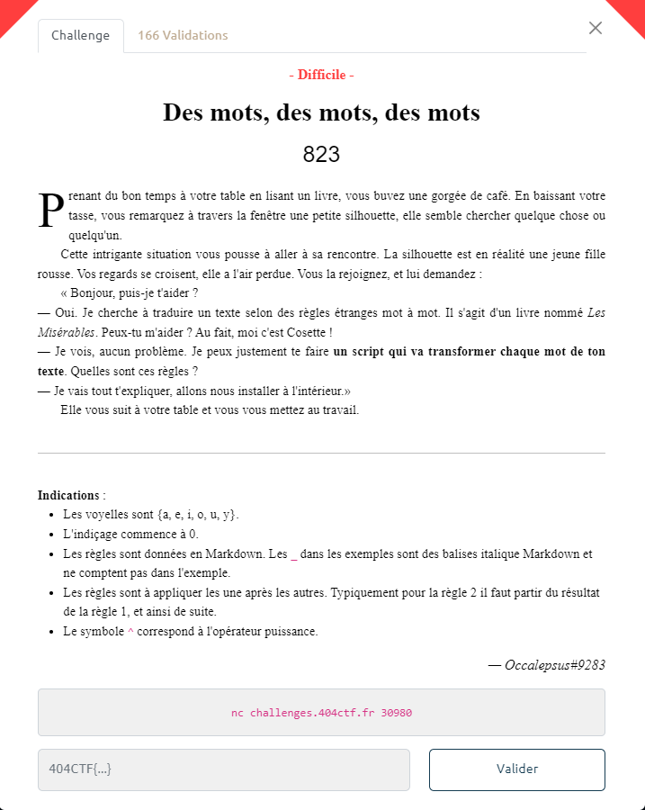

# 404CTF 2023: Des mots, des mots, des mots

### The scenario



In this challenge we need to make some rules and apply them on a chapter. If you are a beginner I recommend you to check `L'inondation` first to understand how to talk with the server with the library socket or pwn

### Starting the challenge

```
└─$ nc challenges.404ctf.fr 30980
Connected tochallenges.404ctf.fr:30980
Commençons. Je te propose de démarrer en transformant mon nom.
Tout d'abord retourne mon nom sans modifications.
Règle 0 : Aucune modification
Entrée : {cosette}
>>
```

###### Rule 0

> Rule 0 : No modification 

Firstly we need to get the input and then apply rule 0

```python
def getinfo(data):
    data = data.split("Entrée :")[1]
    info = data.split("{")[1].split("}")[0]
    return info

def regle0(input):
    return input

data = client.recv(1024).decode()
print(data)

send(regle0(getinfo(data)))
```

It will send cosette

###### Rule 1

```
Je vois que tu as compris. La première règle de ce langage est très simple.
Règle 1 : Inverser les lettres
Entrée : {cosette}
>>
```

> Rule 1 : reverse the letter

⚠️you need to use the output of the last rule 

```python
def regle1(input):
    input = regle0(input)
    return input[::-1]
```

It will send ettesoc

###### Rule 2

```
Oui c'est bien. Maintenant la deuxième règle est un peu plus difficile.
Règle 2 :
- Si le mot à un nombre de lettres pair, échanger la 1ere et la 2e partie du mot obtenu   
- Sinon, enlever toutes les lettres du mot correspondant à la lettre centrale
Entrée : {cosette}
>>
```

> Rule 2 :
> 
> - If the word has an even number of letters, exchange the 1st and 2nd part of the word
> - Elif remove all the letters of the word corresponding to the central letter

```python
def regle2(input):
    input = regle1(input)
    new = ""
    n = len(input)
    if n % 2 == 0:
        new = input[n//2:] + input[:n//2]
    elif n % 2 == 1:
        letter = input[n//2]
        for i in range(n):
            if input[i] != letter:
                new += input[i]
    return new
```

It will send ttsoc for cosette

###### Rule 3

```
Tu t'en sors très bien ! Continuons avec la troisième règle.
Règle 3 :
_Si le mot a 3 lettres ou plus_ :

- Si la 3e lettre du mot obtenu est une consonne, "décaler" les voyelles vers la gauche dans le mot original, puis réappliquer les règles 1 et 2.
- Sinon : la même chose mais les décaler vers la droite.

> Ex de décalage : _poteau => petauo_ // _drapeau => drupaea_
Entrée : {cosette}
>>
```

Rule 3 :

> If the word has 3 or more letters :
> 
> - If the 3rd letter of the resulting word is a consonant, "shift" the vowels to the left in the original word, then reapply rules 1 and 2.
> - Otherwise: the same thing but shift them to the right.
> 
> Otherwise return the resulting word

```python
def regle3(input):
    consonne = set("bcdfghjklmnpqrstvwxz")
    voyelle = set("aeiouy")
    llist = []
    nlist = []
    new = list(input)
    word = regle2(input)
    if len(word) >= 3:
        if word[2] in consonne:
            for i in range(len(input)):
                if input[i] in voyelle:
                    llist.append(input[i])
                    nlist.append(int(i))
            for p in range(len(llist)):
                try:
                    new[(nlist[p])] = llist[p+1]
                except:
                    new[(nlist[p])] = llist[0]
        else:
            for i in range(len(input)):
                if input[i] in voyelle:
                    llist.append(input[i])
                    nlist.append(int(i))
            for p in range(len(llist)):
                try:
                    new[(nlist[p])] = llist[p-1]
                except:
                    new[(nlist[p])] = llist[-1]
        input = ''.join(new)
        return regle2(input)
    else :
        return word 
```

It will send the ottsc

###### Rule 4

```
Nous avons presque fini, la quatrième règle est la plus complexe.
Règle 4 :
- Pour `n` allant de 0 à la fin du mot, si le caractère `c` à la position `n` du mot est une consonne (majuscule ou minuscule), insérer en position `n+1` le caractère de code ASCII `a = ((vp + s) % 95) + 32`, où `vp` est le code ASCII de la voyelle précédant la consonne `c` dans l'alphabet (si `c = 'F'`, `vp = 'E'`), et `s = SOMME{i=n-1 -> 0}(a{i}*2^(n-i)*Id(l{i} est une voyelle))`, où `a{i}` est le code ASCII de la `i`-ième lettre du mot, `Id(x)` vaut `1` si `x` est vrai, `0` sinon, et `l{i}` la `i`-ième lettre du mot. _Attention à bien appliquer cette règle aussi sur les caractères insérés au mot._

> Ex : _futur => f&ut\ur@_

- Enfin, trier le mot par ordre décroissant d'occurrences des caractères, puis par ordre croissant en code ASCII pour les égalités

> Ex de tri : _patate => aattep_
Entrée : {cosette}
>>
```

For this rule, I'll do it part by part because it's really hard and long to understand it

**For `n` going from 0 to the end of the word**

```python
while n < len(input):
    n += 1
```

**if character `c` at position `n` of the word is a consonant (uppercase or lowercase)**

```python
consonnes = set("bcdfghjklmnpqrstvwxzBCDFGHJKLMNPQRSTVWXZ")
c = input[n]
    if c in consonnes:
```

**insert in position `n+1` the ASCII code character `a = ((vp + s) % 95) + 32`**

**where `vp` is the ASCII code of the vowel preceding the consonant `c` in the alphabet**

if `c = 'F'`, `vp = 'E'`

```python
letter = ord(input[n])
while chr(letter-tmp) not in voyelles:
    tmp += 1
vp = (letter-tmp)
```

**and `s = SUM{i=n-1 -> 0}(a{i}*2^(n-i)*Id(l{i} is a vowel))`**

**where `a{i}` is the ASCII code of the `i`th letter of the word**

```python
ai = ord(input[i])
```

**`Id(x)` = `1` if `x` is true and `Id(x)` =`0` if `x` is false**

**and `l{i}` the `i`-th letter of the word**

```python
li = input[i]
if li in voyelles:
    Id = 1
else:
    Id = 0
```

With this we can get the value of `s` and the value of `a`

```python
s += (ai*2**(n-i)*Id)
a = (((vp + s) % 95) + 32)
```

Now we just need to insert in the position `n+4` the ASCII character of `a`

```python
input = input[:n+1] + chr(a) + input[n+1:]
```

**Finally, sort the word in descending order of character occurrences, then in ascending order in ASCII code for equalities**

```python
occurrences = {}
for caractere in input:
    if caractere in occurrences:
        occurrences[caractere] += 1 
    else:
        occurrences[caractere] = 1
caracteres_tries = sorted(occurrences.keys(), key=lambda x: (-occurrences[x], ord(x)))
chaine_triee = ""
for caractere in caracteres_tries:
    chaine_triee += caractere * occurrences[caractere]
return chaine_triee
```

and now we just need to add all the programs together and input the output of the rule 3

```python
def regle4(input):
    consonnes = set("bcdfghjklmnpqrstvwxzBCDFGHJKLMNPQRSTVWXZ")
    voyelles = set("aeiouyAEIOUY")
    tmp = 0
    n = 0
    input = regle3(input)
    while n < len(input):
        c = input[n]
        if c in consonnes:
            letter = ord(input[n])
            while chr(letter-tmp) not in voyelles:
                tmp += 1
            vp = (letter-tmp)
            s = 0
            for i in range(n-1,-1,-1):
                ai = ord(input[i])
                li = input[i]
                if li in voyelles:
                    Id = 1
                else:
                    Id = 0
                s += (ai*2**(n-i)*Id)
            a = (((vp + s) % 95) + 32)
            input = input[:n+1] + chr(a) + input[n+1:]
        n += 1
        tmp = 0
    occurrences = {}
    for caractere in input:
        if caractere in occurrences:
            occurrences[caractere] += 1 
        else:
            occurrences[caractere] = 1
    caracteres_tries = sorted(occurrences.keys(), key=lambda x: (-occurrences[x], ord(x)))
    chaine_triee = ""
    for caractere in caracteres_tries:
        chaine_triee += caractere * occurrences[caractere]
    return chaine_triee
```

It will send PPtt!15QRUWcos

### The last part

```
Chaque mot est écrit en minuscule sans accents ni caractères spéciaux et sont séparés par 
un espace. Tu as 5 secondes pour répondre.
Entrée : {lendemain soleil ... terre}
>>
```

Now we need to apply on each word the rule 4, save the resul and add a little space beetween them, then we just need to send it and that it !

```python
data = client.recv(1024).decode()
if ">>" not in data:
    data += client.recv(1024).decode()
print(data)

resultat = ""
mot = getinfo(data)
mot = mot.split(" ")

for nombre in range(len(mot)):
    temp = regle4(mot[nombre])
    resultat += temp
    if nombre != len(mot)-1:
        resultat += " "

send(resultat)
```

### Flag

We add all the code together it create the file `main.py`

And we get the following flag : 

`[*] FLAG : CTF{:T]cdeikm_)W_doprsu_nt_;adei}`