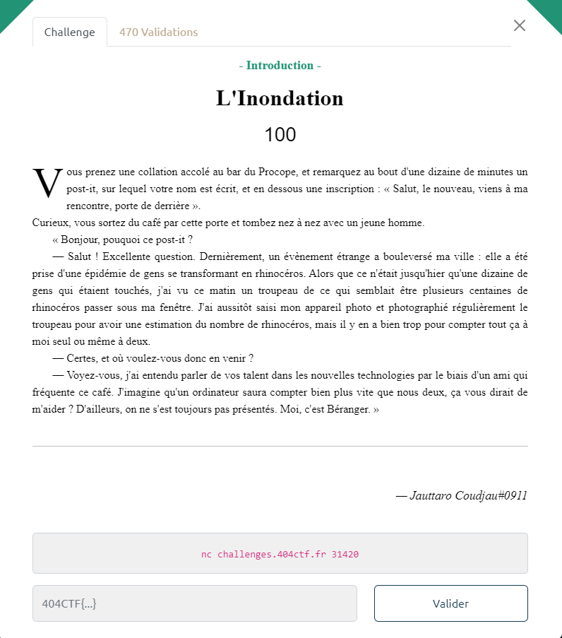

# 404CTF 2023: L'inondation

### The scenario



Basically in this challenge we need to count how many rhino there is on each message, but we need to do it quiclky, and without any error.

```
└─$ nc challenges.404ctf.fr 31420
« Allez, vite, il y a une pile de photos assez importante à traiter,
comptes-moi le nombre de rhinos par photo. »
  ~c`°^)       ~c`°^)                  ~c`°^)    ~c`°^)        ~c`°^)       ~c`°^)
   ~c`°^)         ~c`°^)             ~c`°^)                     ~c`°^)    ~c`°^)
                         ~c`°^)                     ~c`°^)                ~c`°^)
   ~c`°^)                  ~c`°^)       ~c`°^)    ~c`°^)                  ~c`°^)
 ~c`°^)        ~c`°^)                             ~c`°^)
                ~c`°^)                ~c`°^)                             ~c`°^)
                          ~c`°^)      ~c`°^)          ~c`°^) ~c`°^)                 ~c`°^)
  ~c`°^)                                  ~c`°^) ~c`°^)     ~c`°^)      ~c`°^)         ~c`°^)
  ~c`°^)                             ~c`°^)     ~c`°^)                     ~c`°^)     ~c`°^)
                  ~c`°^)                                                  ~c`°^)
             ~c`°^)                 ~c`°^)         ~c`°^)     ~c`°^)      ~c`°^)
 ~c`°^)                                ~c`°^)                            ~c`°^)
~c`°^)                     ~c`°^)     ~c`°^)      ~c`°^)     ~c`°^)                 ~c`°^)
               ~c`°^)     ~c`°^)      ~c`°^)     ~c`°^)
                                                      ~c`°^)~c`°^)            ~c`°^)   ~c`°^)
              ~c`°^)                                              ~c`°^)                ~c`°^)
  ~c`°^)     ~c`°^)           ~c`°^)~c`°^)            ~c`°^)
                  ~c`°^)~c`°^)            ~c`°^)                ~c`°^)
      ~c`°^)~c`°^)                                                            ~c`°^)
                           ~c`°^)       ~c`°^)   ~c`°^)
      ~c`°^)   ~c`°^)       ~c`°^)   ~c`°^)                       ~c`°^)      ~c`°^)~c`°^)
                         ~c`°^)                                         ~c`°^)
                              ~c`°^)                  ~c`°^)                         ~c`°^)
 ~c`°^)           ~c`°^)                                         ~c`°^)  ~c`°^)
      ~c`°^)      ~c`°^)      ~c`°^)                                       ~c`°^)
      ~c`°^)      ~c`°^)~c`°^)           ~c`°^)  ~c`°^)        ~c`°^)               ~c`°^)
      ~c`°^)~c`°^)           ~c`°^)  ~c`°^)        ~c`°^)      ~c`°^)
~c`°^)           ~c`°^)  ~c`°^)        ~c`°^)                               ~c`°^)
     ~c`°^)  ~c`°^)        ~c`°^)               ~c`°^)                        ~c`°^)~c`°^)
               ~c`°^)               ~c`°^)                              ~c`°^)       ~c`°^)
               ~c`°^)                   ~c`°^)        ~c`°^)~c`°^)
   ~c`°^)                                 ~c`°^)             ~c`°^)          ~c`°^)   ~c`°^)
Combien de rhinocéros comptez-vous dans cette image ?
Votre réponse :
>
```

### Counting rhino

The goal here is to count how many **~c`°^)** there is on this message, we can make this fonction :

```python
def countrhino(donnees):
    donnees = donnees.split("»")[1]
    nb = donnees.count("~")
```

Now we only need to talk with the server

```python
import socket

HOST = 'challenges.404ctf.fr'
PORT = 31420

client = socket.socket(socket.AF_INET, socket.SOCK_STREAM)
client.connect((HOST, PORT))
print('Connected to' + HOST + ':' + str(PORT)) 

def send(donnees):
    message = "{}\n".format(donnees)
    client.send(message.encode())
    print("MESSAGE SEND :", message)

donnees = client.recv(1024)
print(donnees.decode())
countrhino(donnees.decode())

print('Deconnexion.')
client.close()
```

But there is a problem, the server sometime is sending multiple packet, so we need to check if there is `Votre réponse :` in the data before starting counting

```python
p = 0
for i in range(101):
    donnees = b''
    while b":" not in donnees and p < 550:
        p += 1
        tampon = client.recv(1024)
        donnees += tampon
    print(donnees.decode())
```

### The final script

```python
import socket

HOST = 'challenges.404ctf.fr'
PORT = 31420

client = socket.socket(socket.AF_INET, socket.SOCK_STREAM)
client.connect((HOST, PORT))
print('Connected to' + HOST + ':' + str(PORT))

def send(donnees):
    message = "{}\n".format(donnees)
    client.send(message.encode())
    print("MESSAGE SEND :", message)

def countrhino(donnees):
    donnees = donnees.split("»")[1]
    nb = donnees.count("~c`°^)")
    send(nb)

def fin(donnees):
    flag = donnees.split("404")[1]
    print("[*] FLAG :",flag)

p = 0

for i in range(101):
    donnees = b''
    while b":" not in donnees and p < 550:
        p += 1
        tampon = client.recv(1024)
        donnees += tampon
    print(donnees.decode())
    countrhino(donnees.decode())

print('Deconnected.')
client.close()

fin(donnees.decode())
```

### Flag

```
└─$ python3 main.py
...
« Très bien, la suite arrive ! »
« Bien joué ! Avant que tu partes, ta récompense. »

Il vous tend une enveloppe.
 « Ouvres-la une fois qu'il n'y a personne autour de toi. »
Vous faites exactement cela, à l'intérieur se trouve un billet, et une lettre. Dessus il est marqué 404CTF{4h,_l3s_P0uvo1rs_d3_l'iNforM4tiqu3!}

MESSAGE SEND : 0

Deconnected.
[*] FLAG : CTF{4h,_l3s_P0uvo1rs_d3_l'iNforM4tiqu3!}
```

`[*] FLAG : CTF{4h,_l3s_P0uvo1rs_d3_l'iNforM4tiqu3!}`
