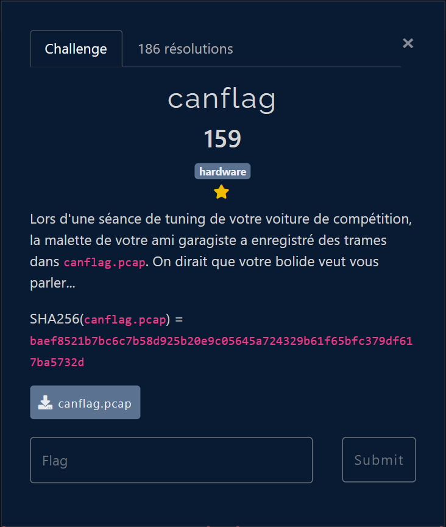
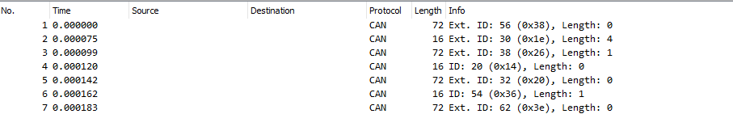
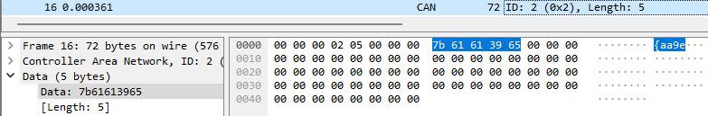
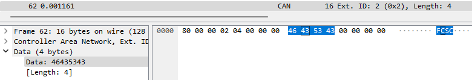
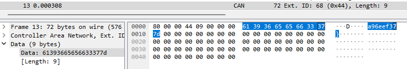
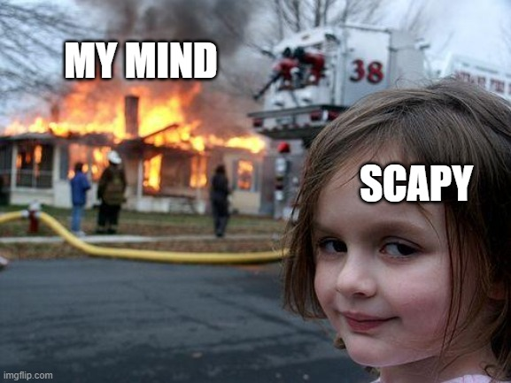

# FCSC 2023: canflag challenge

### The scenario



In this challenge, we have a pcap capture and we need to solve what the car are saying 


If we open the capture file it look's like this :



### More information on the context

After a little bit of research in the file we can see the Ext ID and the ID go from 2 to 68 in steps of 2 and sometime they skip some numbers 

The main things is we know the format of the flag and it's like this FCSC{...}. In the capture there is **FCSC** in the Ext ID 2 data's, and in the ID 2 data's there is **{aa9e**, in the Ext ID68 there is **a96eef37}**







With this information we can think the flag is : 

$$
eid_{2}+id_{2}+eid_{4}+id_{4} + ... + eid_{68} + id_{68}
$$

### Create the flag

Easy you would say, we just need to do this :

```python
from scapy.all import *

capture = rdpcap('canflag.pcap')
```

> But ... **Scapy_Exception: Not a supported capture file**



**So I did it by my hand ...**

```python
e56 = ""
e30 = "1d8a"
e38 = "2"
i20 = ""
e32 = ""
i54 = "d"
i62 = ""
i66 = ""
e8  = ""
i40 = "01c50b0"
i46 = ""
i28 = "ffbeb9ca92ac"
e68 = "a96eef37}"
i18 = ""
i60 = "797295c3cc5875"
i2  = "{aa9e"
i22 = "603d6a11"
e60 = ""
e44 = "a78e68255"
e48 = "c"
i8  =  ""
e10 = ""
i14 = "8e"
e54 = ""
e20 = "5"
e42 = ""
i34 = '27d'
e52 = "2f60c"
i6  = "f0a2ea5e233"
i30 = "ee3cd919184a"
i4  = ""
e22 = "f6b47b9f"
i42 = "e57be6a1560"
e50 = "e660ce71f6e210"
e16 = ""
e36 = ""
i58 = "39e60c6"
i38 = "dd4f"
i36 = "6afd"
i12 = "456df7db4"
e34 = ''
i50 = "13d1f248"
i24 = "b4"
e4  =  "d"
i16 = ""
e12 = "cc055a"
e28 = "1"
i62 = "7bdeaa"
e26 = ""
i56 = "bc14f37020b5a4"
i10 = "bdc3fc49535a09"
e24 = "71d20b15458b7"
e46 = ""
e18 = ""
e64 = ""
e14 = "ab"
i32 = ""
i44 = "6"
i26 = "4ac"
i52 = "e1732e5983"
e66 = "85"
e2  = "FCSC"
i64 = ""
e40 = ""
e58 = ""
i48 = "529f74d8b04f8"
e6  = ""
```

And then with the following code I add all of the string together and sort them to get the flag

```python
a = ""
for i in range(2, 70, 2):
    var_name = "e" + str(i)
    if var_name in locals() and locals()[var_name] is not None:
        a += locals()[var_name]
    var_name = "i" + str(i)
    if var_name in locals() and locals()[var_name] is not None:
        a += locals()[var_name]
print(a)
```

### Flag

We then obtain the following flag: 

`FCSC{aa9edf0a2ea5e233bdc3fc49535a09cc055a456df7db4ab8e5f6b47b9f603d6a1171d20b15458b7b44ac1ffbeb9ca92ac1d8aee3cd919184a27d6afd2dd4f01c50b0e57be6a1560a78e682556c529f74d8b04f8e660ce71f6e21013d1f2482f60ce1732e5983dbc14f37020b5a439e60c6797295c3cc58757bdeaa85a96eef37}
`
