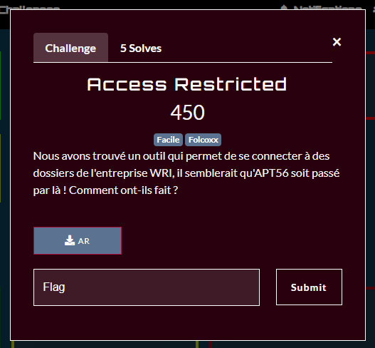
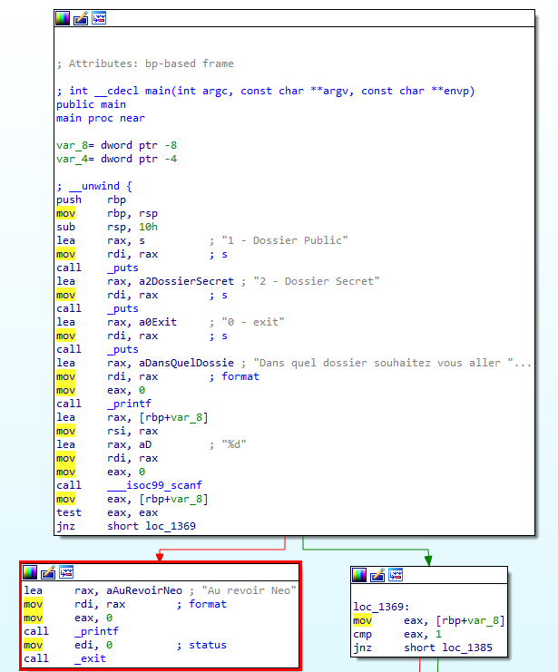
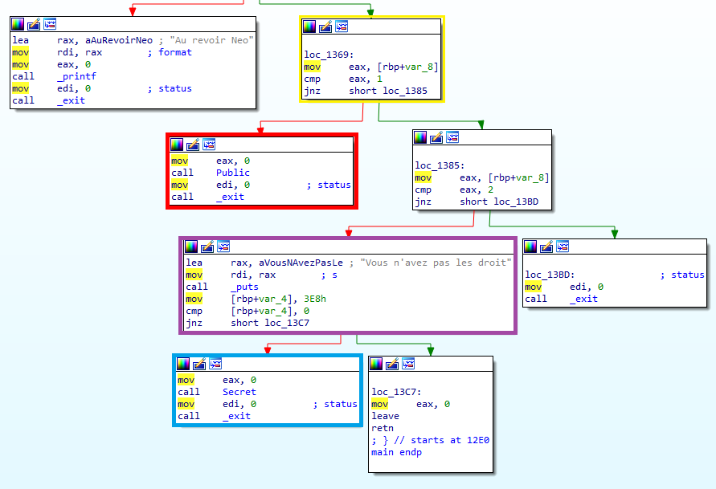
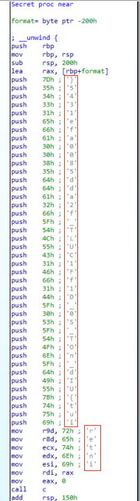

# InterIUT 2023 : Access Restricted

### The scenario



In this challenge we need to understand how the file `AR` works to access to the file of WRI

```shell
└─$ file AR
AR: ELF 64-bit LSB pie executable, x86-64, version 1 (SYSV), dynamically linked, interpreter /lib64/ld-linux-x86-64.so.2, BuildID[sha1]=f109aee09985d4b38234d22b6550b4510ee9ec45, for GNU/Linux 3.2.0, not stripped
```

It's a ELF file ! We can use ghidra or IDA to decompile it, I will use ida 

Just before that, If we try to play a little bit with the file 

```shell
└─$ ./AR
1 - Dossier Public
2 - Dossier Secret
0 - exit
Dans quel dossier souhaitez vous aller ? 0
Au revoir neo
└─$ ./AR
1 - Dossier Public
2 - Dossier Secret
0 - exit
Dans quel dossier souhaitez vous aller ? 1
drwxrwxrwx 2 root root    4,0K 11 mai   18:20 .
drwxrwxrwx 5 root root    4,0K 11 mai   18:20 ..
drwxrwxrwx 1 root root    4,0K 11 mai   18:32 flag.fake
└─$ ./AR
1 - Dossier Public
2 - Dossier Secret
0 - exit
Dans quel dossier souhaitez vous aller ? 2
Vous n'avez pas les droits
```

We need to check with ida what happening when we try to put the input **2**



In the left block (Red block) we can see it's happening if we put **0**



In the right one if we put **1** the script will call the function **Public** but we don't really need it (Red block)

Bellow it if we put **2** (Purple block), we can see the script tell us we can't access it, but it's still calling the function Secret (Blue block), so I'm checking what is happening in the Secret function 



And we see the flag in plain text reversed (Red block)

# Flag

`interiut{UId_nOT_S0_D1fF1CULT_f2add5800afe1345}`
