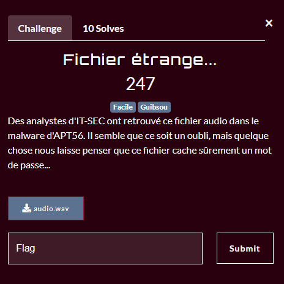

# InterIUT 2023 : Fichier étrange...

### The scenario



In this challenge we have a file `audio.wav` and it seems like there is a password in this file

If we try to listen to the file, the music is not even 1 sec, so I tried to check if the flag was a real wav file

```shell
└─$ file audio.wav
audio.wav: RIFF (little-endian) data, WAVE audio, Microsoft PCM, 8 bit, mono 44100 Hz
```

Yes, it's ...

Then the flag must be in raw data in the file 

```shell
└─$ strings audio.wav
RIFF9
WAVEfmt
data
interiut{B!nArys0und}
```

# Flag

`interiut{B!nArys0und}`
