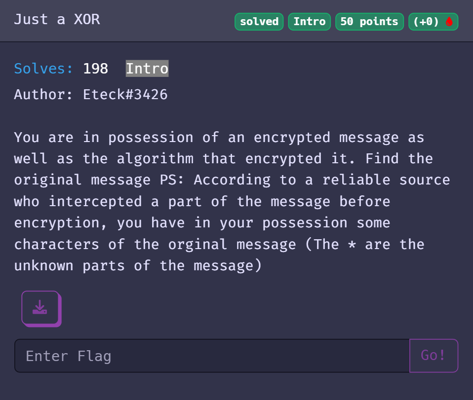
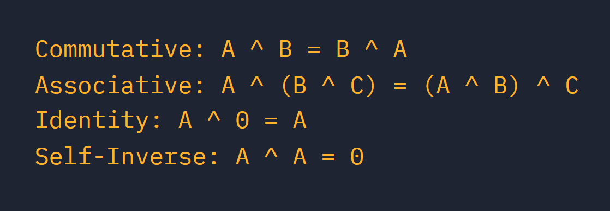

# PWNME 2023: Just a XOR

### The scenario



We have the script bellow : 

```python
#!/usr/bin/env python3
import random
from itertools import cycle

MESSAGE = open("./original-message.txt", "r").read()
SECRET = [chr(random.randint(0,0x2600) % 256) for i in range(16)]

def encrypt(message):
    return [str((ord(a) ^ ord(b))) for a, b in zip(message, cycle(SECRET))]


with open('./message-encrypted.txt', 'w') as f:
    f.write(','.join(encrypt(MESSAGE)))
```

with the following message-encrypted.txt : `3804,6106,4562,8583,4559,3066,6690,9714,3901,7334,4777,7969,8139,3088,4719,2378,3834,6037,4501,8649,4585,2989,6753,9723,3900,7409,4858,7964,8161,3170,4662,2386,3808,6087,4501,8660,4520,3060,6753,9680,3900,7400,4797,7990,8143,3140,4707,2377,3822,6081,4503,8648,4584,3066,6779,9658,3955,7374,4799,7990,8139,3088,4735,2390,3759,6092,4497,8658,4596,3066,6695,9727,3890,7393,4832,8036,8190,3175,4696,2408,3786,6094,4559,8659,4569,2957,6773,9696,3852,7412,4841,8048,8143,3196,4719,2426,3781,6080,4557,8660,4529,2949,6656,9676,3883,7350,4744,7993,8078,3089,4662,2402,3808,6106,4506,8583,4586,2991,6690,9720,3955,7392,4789,7990,8078,3140,4734,2368,3759,6107,4507,8671,4594,3066,6690,9723,3890,7402,4790,7969,8128,3159,4723,2390`

and the following intercepted-original-message.txt : `S*********s***y***k************w***s****************n***********************P***********_r*4*********************o***uck*****t******************`

### Quick lesson about XORING

There are four main properties we should consider when we solve challenges using the XOR operator



The main things we are going to use are:

```
A = (A ^ B) ^ B 
```

With this we can try to get the key of the XORING method used with the letter from the message intercepted and the outputfile

### Starting solving the challenge

The goal will be to find the SECRET variable in the main python script

A huge piece of information : we know the variable is between 0 and 0x2600 and there are 16 letters like this

```python
random.randint(0,0x2600)) for i in range(16)
```

So we are going to try XORING each number for each character (if the letters isn't a `*`) in the intercepted message and compare it to the encrypted message.

And then save the XOR key in a variable in the good position

Don't forget to put %16 in your loop because the main code reuses the SECRET variable :

```python
cycle(SECRET)
```

So we are going to get the following script :

```python
text = open("./intercepted-original-mesage.txt", "r").read()
output = open("./message-encrypted.txt", "r").read()
output = output.split(",")

Force = []
SECRET=[[0]]*16

for i in range(0,0x2600):
    Force.append(chr(i))

for x in range(len(text)):
    if text[x] != "*":
        print("Letter: {} Position: {}  Encrypted as: {}".format(text[x],x%16,output[x]))
        for number in Force:
            if (str(ord(text[x]) ^ ord(number))) == output[x]:
                print("XOR key: {}\n".format(ord(number)))
                SECRET[x%16] = ord(number)

print(f"Total XOR key: {SECRET} \n")
```

The SECRET variable will be : ``[3727, 6069, 4606, 8615, 4486, 3034, 6721, 9619, 3923, 7302, 4826, 8004, 8110, 3120, 4630, 2341]``

### Solving the challenge

Now we just need to use the SECRET variable on the output file and we will get the original message !

```python
from itertools import cycle

def decrypt(message):
    return [chr(int(a) ^ b) for a , b in zip(message,cycle(SECRET))]

with open("./output.txt","w") as f:
    f.write("".join(decrypt(output)))

print(open("./output.txt","r").read())
```

output : `So, I can see you know how XOR works.. Congratulation :) Here is your flag: PWNME{1t_W4s_r34aLy_Ju3s7_A_x0R} ! Good luck for the next challenges`

### Flag

`PWNME{1t_W4s_r34aLy_Ju3s7_A_x0R}`