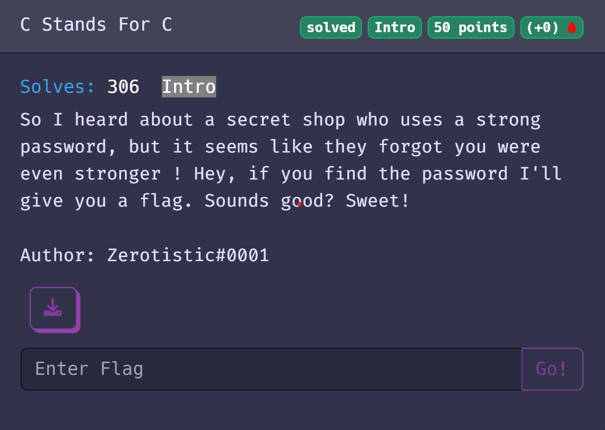
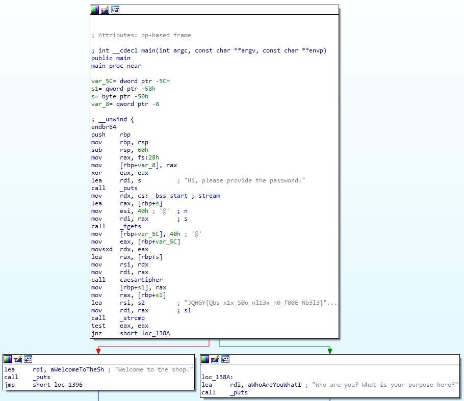

# PWNME 2023 : C Stands For C

### The scenario



In this challenge we have a binary file named `C_Stands_For_C`

If we try to run it we have this : 

```shell
└─$ ./C_Stands_For_C
Hi, please provide the password:
Idk #input
Who are you? What is your prupose here
```

### In depth of this challenge

Because it's a reverse challenge I will use ida do try to recreate the script

I have this following script :



We can easly see the `Welcome to the shop.` and `Who are you? What is your purpose here?` after `Hi, please provide the password:`

beetween those line there is this strings : `JQHGY{Qbs_x1x_S0o_nl13x_n0_f00E_Nb3l3}`

But if we try to put it on the script it will still say `Who are you?`

If we search a little bit more, there is the word `caesarCipher` We will then bruteforce the caesar cipher.  Or guess the number shift used. 

### Solving the challenge with bruteforce

```python
def caesar_cipher(message, shift):
    cipher_text = ""
    for char in message:
        if char.isalpha():
            ascii_code = ord(char) + shift
            if char.isupper():
                if ascii_code > ord('Z'):
                    ascii_code -= 26
                elif ascii_code < ord('A'):
                    ascii_code += 26
            else:
                if ascii_code > ord('z'):
                    ascii_code -= 26
                elif ascii_code < ord('a'):
                    ascii_code += 26
            cipher_text += chr(ascii_code)
        else:
            cipher_text += char
    return cipher_text

for i in range(27):
    print(i,caesar_cipher("JQHGY{Qbs_x1x_S0o_nl13x_n0_f00E_Nb3l3}",i))
```

We have this result :

```
1 KRIHZ{Rct_y1y_T0p_om13y_o0_g00F_Oc3m3}
2 LSJIA{Sdu_z1z_U0q_pn13z_p0_h00G_Pd3n3}
3 MTKJB{Tev_a1a_V0r_qo13a_q0_i00H_Qe3o3}
4 NULKC{Ufw_b1b_W0s_rp13b_r0_j00I_Rf3p3}
5 OVMLD{Vgx_c1c_X0t_sq13c_s0_k00J_Sg3q3}
6 PWNME{Why_d1d_Y0u_tr13d_t0_l00K_Th3r3}
7 QXONF{Xiz_e1e_Z0v_us13e_u0_m00L_Ui3s3}
8 RYPOG{Yja_f1f_A0w_vt13f_v0_n00M_Vj3t3}
9 SZQPH{Zkb_g1g_B0x_wu13g_w0_o00N_Wk3u3}
10 TARQI{Alc_h1h_C0y_xv13h_x0_p00O_Xl3v3}
11 UBSRJ{Bmd_i1i_D0z_yw13i_y0_q00P_Ym3w3}
12 VCTSK{Cne_j1j_E0a_zx13j_z0_r00Q_Zn3x3}
13 WDUTL{Dof_k1k_F0b_ay13k_a0_s00R_Ao3y3}
14 XEVUM{Epg_l1l_G0c_bz13l_b0_t00S_Bp3z3}
15 YFWVN{Fqh_m1m_H0d_ca13m_c0_u00T_Cq3a3}
16 ZGXWO{Gri_n1n_I0e_db13n_d0_v00U_Dr3b3}
17 AHYXP{Hsj_o1o_J0f_ec13o_e0_w00V_Es3c3}
18 BIZYQ{Itk_p1p_K0g_fd13p_f0_x00W_Ft3d3}
19 CJAZR{Jul_q1q_L0h_ge13q_g0_y00X_Gu3e3}
20 DKBAS{Kvm_r1r_M0i_hf13r_h0_z00Y_Hv3f3}
21 ELCBT{Lwn_s1s_N0j_ig13s_i0_a00Z_Iw3g3}
22 FMDCU{Mxo_t1t_O0k_jh13t_j0_b00A_Jx3h3}
23 GNEDV{Nyp_u1u_P0l_ki13u_k0_c00B_Ky3i3}
24 HOFEW{Ozq_v1v_Q0m_lj13v_l0_d00C_Lz3j3}
25 IPGFX{Par_w1w_R0n_mk13w_m0_e00D_Ma3k3}
26 JQHGY{Qbs_x1x_S0o_nl13x_n0_f00E_Nb3l3}
```

We can see a typical flag : PWNME{..}

```shell
└─$ ./C_Stands_For_C
Hi, please provide the password:
PWNME{Why_d1d_Y0u_tr13d_t0_l00K_Th3r3} #input
Welcome to the shop.
```

### Flag

`PWNME{Why_d1d_Y0u_tr13d_t0_l00K_Th3r3}`
